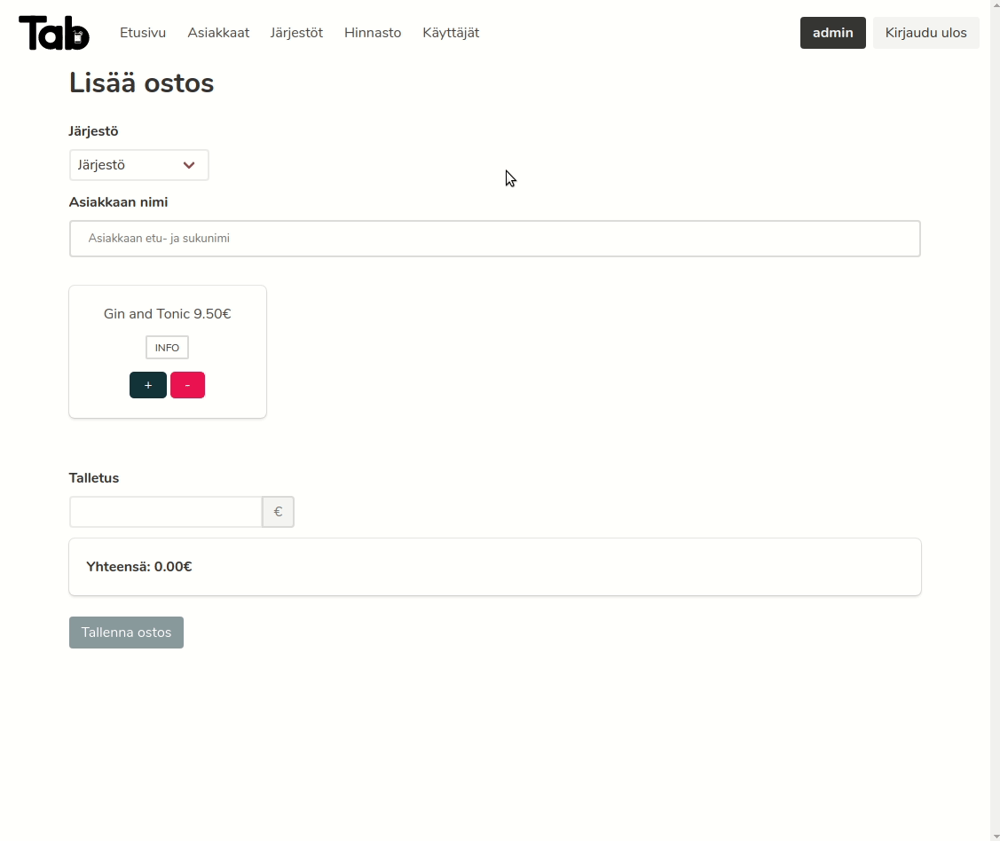

# Tab list

Tab list's purpose is to keep track of each customer's tab and simplify customer management. The idea is simple: if the customer buys a drink his/her account's balance will decrease. If the customer deposits to his/her account the balance will increase.

## Purchase in the app

## Features

Demos of the core features can be found [here](./docs/instructions.md)

The features might change during the development.

- Login/Register, Admin/User (User can register with admin's permission)
- Change password
- Customer: add/remove/block/modify
- Organization: add/remove/modify
- Drink: add/remove/modify
- Purchase history
