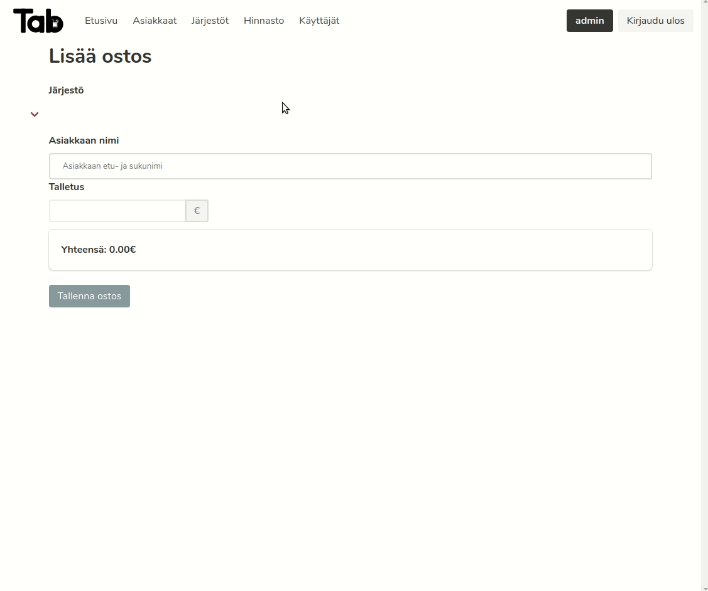
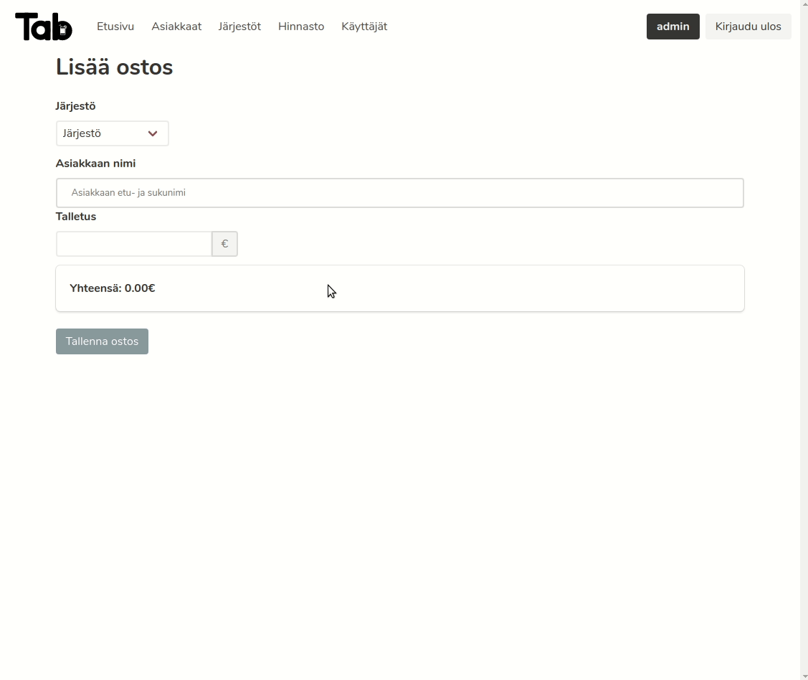
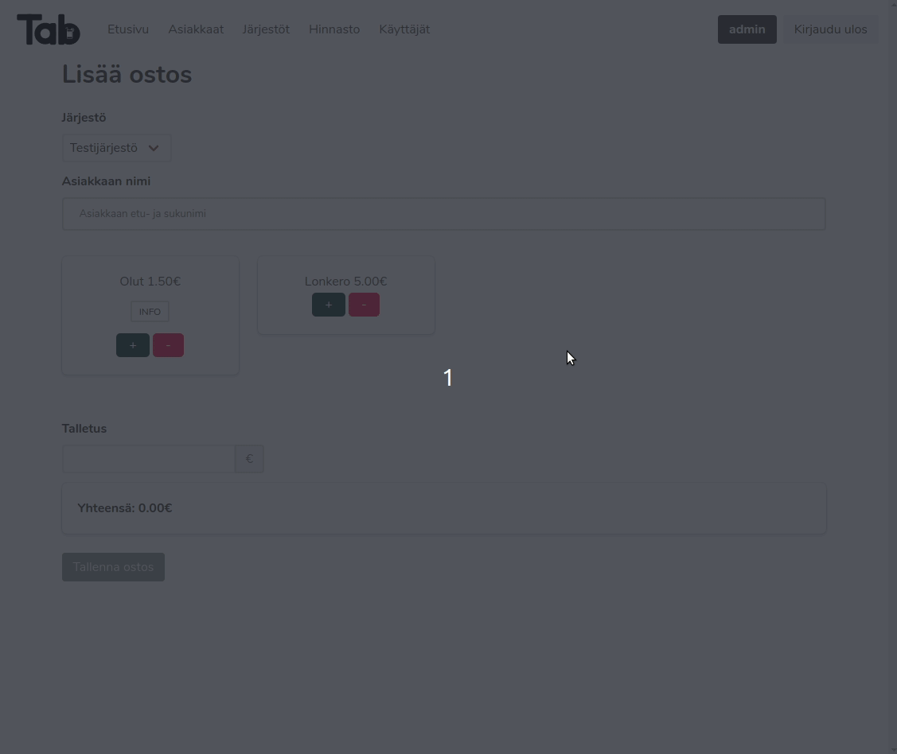

# How to use the app

To access the running app open open `http://localhost:3001` on your favourite browser.
The default password for admin is `admin`

## Adding an organization

When adding an organization you must specify an unique name and a maximum tab for a customer who belongs to that organization. When ordering the customer's balance cannot be less than the specified tab limit. For example if <strong>the total is 15€</strong>, the customer's <strong>balance is 0€</strong> and the <strong>maximum tab is 15€</strong> for the organization, the <strong>order will not be executed.</strong>

## Adding a customer

Every customer must belong to exactly one organization. Also every customer must have at least first name, last name and initial balance.

### Multiple customers with the same name

As long as customers do not belong to the same organization there can exists multiple customers with the same name. However if they belong to the same organization they must be identified with year of birth.

## Adding a drink

Every drink must have a unique name and price that is greater than or equal to 0. You need to select drinks that will be shown on the front page.

## Ordering

## Changing password

